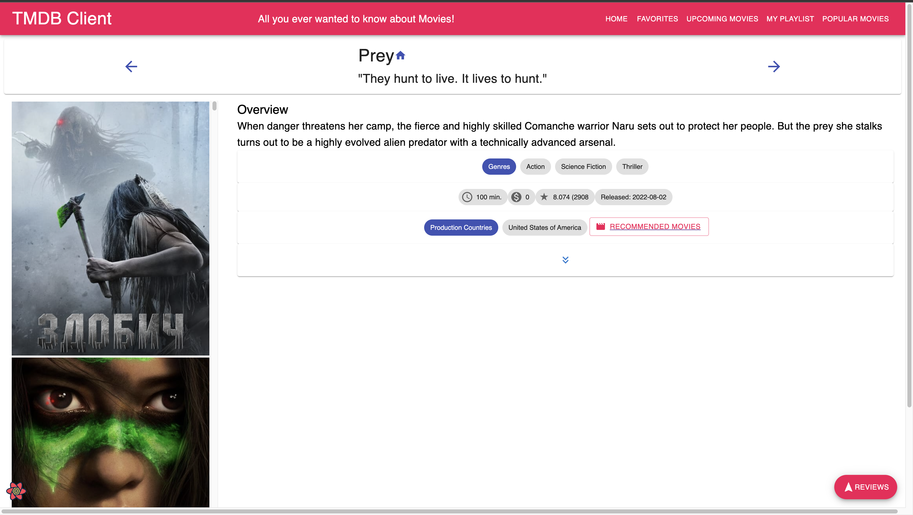

# Assignment 1 - ReactJS app.

Name: Durgaashini Sagaran

## Overview.

This project is about react act app for Movie App database

### Features.
 
+ Contains popular movies pages which shows movies that are trending
+ Contains recommendation pages when user click on more info of the the movies in homepage or upcoming movies, there will be a button called "Similiar Movies" below the overview.
+ Contains casts info, shows up when user clicks onmore info, the cast is below the overview of the selected movie.
+ Contains pagination for the main pages like Homes Page, Upcoming Movies Page, Popular Movies Page, Recommendation Page.

## Setup requirements.

[ Outline any non-standard setup steps necessary to run your app locally after cloning the repo.]

After cloning the repo, :-

1. run 'npm install'

2. Collect your API key from TMDB, and change the API key in '.env' file of the code. You should change you API key at this line of code -> 'REACT_APP_TMDB_KEY'.

## API endpoints.

[ List the __additional__ TMDB endpoints used, giving the description and pathname for each one.] 

+ Discover list of movies - discover/movie
+ Movie details - movie/:id
+ Movie genres = /genre/movie/list
+ Movie Images = /movie/{movie_id}/images
+ Movie Reviews = /movie/{movie_id}/reviews
+ Upcoming Movies = /movie/upcoming
<!-- NEW -->
+ Trending Movies = /trending/movie/day
+ Movie Recommendation = /movie/{movie_id}/recommendations
+ Movie Cast = /movie/{movie_id}/credits 

## App Design.

### Component catalogue.

[ Insert a screenshot from the Storybook UI that lists all the stories for the app's components, and highlight those relating to your __new/modified components__ - see the example screenshot below.] .......

### UI Design.

[ Insert screenshots of the __new/modified app pages__ you developed (and modified existing pages), Include an appropriate caption for each one (see example below).

1. HomePage = Home

2. Favourites

3. Upcoming Movies

4. My Playlist 

5. Popular Movies

6. Similar Movies / Recommendation Movies

7. Movie Cast

### Routing.

[ List the __new routes__ supported by your app and state the associated page.]
+ "/" - HomePage
+ /movies/:id - MoviePage
+ /reviews/form - AddMovieReviewPage
+ /reviews/:id - MovieReviewPage
+ /movies/favorites - FavoriteMoviesPage
+ /movies/upcoming - UpcomingMoviesPage
+ /movies/playlist - PlaylistMoviesPage
<!-- NEW -->
+ /movies/popular - PopularMoviesPage
+ /movies/cast/:id - CastPage
+ /movies/recommendations/:id - RecommendationsPage

## Independent learning (If relevant).

[ Itemize the technologies/techniques you researched independently and adopted in your project, i.e. aspects not covered in the lectures/labs. Include the source code filenames that illustrate these (we do not require code excerpts) and provide references to the online resources that helped you (articles/blogs).

1. https://developers.themoviedb.org/3/movies/get-movie-credits & https://mui.com/material-ui

2. Pagination :-

+ https://www.npmjs.com/package/react-paginate
+ https://mui.com/material-ui/react-pagination/#main-content

